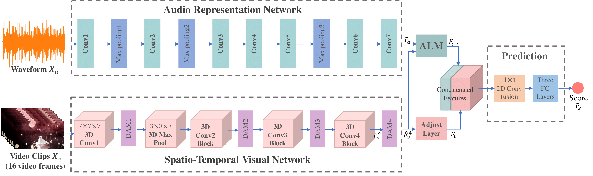

# AudioVisual-MSNet
Multi-modal Movie Summarization Model.

<div align="center">
  
<p>Some samples of our Movie50 dataset and the corresponding attention maps.</p>
</div>

## Framework
<p align = "left">our AudioVisual-MSNet consists of a spatio-temporal visual network to extract visual features of video clips, an audio representation network for audio feature extraction, an audio localization module (ALM) to excavate the correspondences between spatio-temporal visual and audio information, and a prediction module to estimate the importance score.</p>
<div align="center">
  
<p>Overview of our AudioVisual-MSNet framework.</p>
</div>

## Requirements

* Python 3 : tested with 3.5
* [PyTorch](http://pytorch.org/) : tested with versions from 0.4 to 1.4.0
* GPU support (ideally multiple) : tested with 4 NVIDIA GTX1080Ti or RTX2080Ti
* MATLAB (for computing the evaluation metrics) : tested with R2015a or newer

You can install the required python packages with the command: 
```bash
pip install -r requirements.txt --user
```

## Run training and testing code

The structure of data directories:

```misc
AudioVisual-MSNet/
  data/
    video_frames/ 
        .../ (directories of datasets names) 
    video_audio/ 
        .../ (directories of datasets names)
    annotations/ 
        .../ (directories of datasets names) 
    fold_lists/
        *.txt (lists of datasets)
    pretrained_models/
        av-msnet_visual_only/
            visual_save_60.pth
        av-msnet_audiovisual/
            audiovisual_save_60.pth
        resnet-50-kinetics.pth
        soundnet8.pth
```

Confirm all options for the AudioVisual-MSNet parameters:
```bash
python main.py -h
```
If you use less than our default 4 GPUs you should modify the ```--gpu_devices 0,1,2,3 --batch_size 128 --n_threads 12``` accordingly.

* Train AudioVisual-MSNet model and produce the predicted results for the test sets:
```bash
bash run_audiovisual_train_test.sh
```

* Produce the predicted results for test sets using our trained AudioVisual-MSNet models:
```bash
bash run_audiovisual_test.sh
```

* Produce the predicted results for test sets using our trained AudioVisual-MSNet visual only models (for comparisons):
```bash
bash run_visual_only_test.sh
```